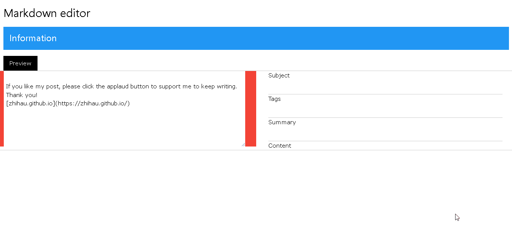

# markdown-editor
An example implements markdown to html and copy to clipboard in JavaScript.

## Pros 
* This is a html tool.

## Why I create this? 
I create the markdown editor for [matters.news](https://matters.news/). I like to write text with markdown format. But the online editor of [matters.news](https://matters.news/) doesn't support this feature. So I need a tool to convert my post to html format. 

When I post an article, I follow below steps.
* Open the markdown editor.
* Edit something with markdown format at left side text area.
* When you edit markdown text follow a format, it will show text in a specific input box at right side container. For example:
    * Type `subject: <subject>`. Click *preview* button. The text of subject will show in the subject input box at right side container . Focus on subject input box to copy text to clipboard. 
    * Type `tags: <tags>`. Click *preview* button. The text of tags will show in the tags input box at right side container .Focus on tags input box to copy text to clipboard. 
    * Type `summary: 
`. Click *preview* button. The text of summary will show in the summary input box at right side container .Focus on summary input box to copy text to clipboard. 
    * Click on the text of content to select all text. Right click to copy text by choose the copy menu item.
* Click *preview* button to view HTML of markdown at right side container.
* When I complete my article, I will copy subject, tags, summary and content to the online editor of [matters.news](https://matters.news/).

These copy behaviors are so boring. Every site has it's own layout of online editor. So I have to copy from here paste to there. Why not just write here and upload everything? It's so simple. Therefore, I write articles on [vimwiki](https://github.com/vimwiki/vimwiki). Use git push to upload my articles to github site. Then I can view my new articles on [zhihau.github.io](https://zhihau.github.io/).

## Markdown format
SUBJECT: <subject>

TAGS: anima, lucky, fortune

SUMMARY: 

&#35; Content
&#35;&#35; sub-title

If you like my post, please click the applaud button to support me to keep writing. Thank you!

[zhihau.github.io](https://zhihau.github.io/)

## 🎇Demo 

## ♥ Buy me a coffee
If the utility solves your problem, you can buy me a coffee via [this link](https://www.buymeacoffee.com/zhihau).
  
## License
MIT
